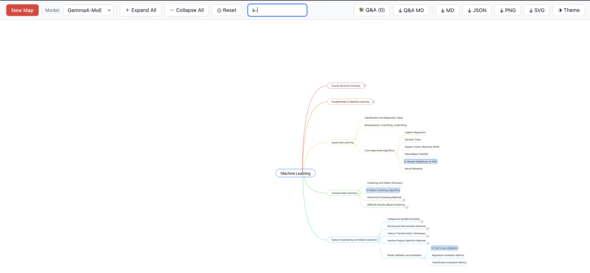
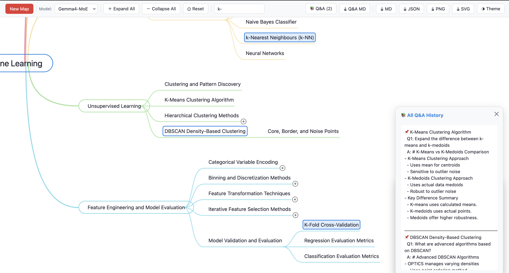

# Smart Mind Map

A standalone, LLM-powered mind-map application built with **FastAPI**, **SQLite**, and **Mind Elixir**. Paste text or Markdown, upload a text file, or restore an exported map; the app asks an OpenAI-compatible LLM to create a structured concept hierarchy and renders it as an interactive, expandable mind map.

The application is designed to work with OpenAI as well as compatible hosted or local endpoints that implement the OpenAI chat-completions API.

## Features

- Generate a mind map from pasted text, Markdown, or `.txt`/`.md` files or a `.json` file saved from a previous run 
- Use any model returned by the configured OpenAI-compatible endpoint
- Expand a node with LLM-generated child concepts
- Collapse branches, expand/collapse all visible nodes, pan, and re-center the map
- Search node labels; matching nodes and their ancestor paths are expanded automatically
- Ask node-specific questions through the built-in Q&A panel
- Preserve graph sessions in SQLite and restore the active session after a browser refresh
- Export the map as Markdown, JSON, PNG, or SVG
- Export the in-browser Q&A history as Markdown
- Toggle light and dark themes; Mind Elixir canvas colors remain synchronized with the selected theme
- Color-code root-level branches and their descendants

## Architecture

```text
Browser (templates/index.html)
  ├─ Mind Elixir rendering, search, imports/exports, node Q&A UI
  └─ fetch() requests to FastAPI API endpoints
           │
           V
FastAPI (backend/main.py)
  ├─ Serves the Jinja template at /
  ├─ Calls an OpenAI-compatible LLM endpoint
  ├─ Converts generated Markdown into a graph
  └─ Reads/writes sessions to SQLite
           │
           V
mindmap_sessions.db
```

The frontend is intentionally self-contained: its CSS and JavaScript live in `templates/index.html`, and Mind Elixir is imported from a CDN. The backend holds the graph model, API routes, LLM calls, and SQLite persistence.

## Project layout

```text
.
├── backend/
│   └── main.py              # FastAPI app, LLM integration, graph/session logic
├── templates/
│   └── index.html           # Interactive Mind Elixir frontend
├── mindmap_sessions.db      # Created/updated automatically at runtime
├── requirements.txt
└── README.md
```

Run the server from the project root. The database path is relative (`mindmap_sessions.db`), so starting Uvicorn from another directory will create or use a database there instead.

## Requirements

- Python 3.10+
- An OpenAI-compatible API endpoint with chat-completions and model-listing support
- Network access for the browser to load Mind Elixir from `esm.sh`

Install Python dependencies:

```bash
python -m venv .venv
source .venv/bin/activate        # Windows PowerShell: .venv\Scripts\Activate.ps1
pip install -r requirements.txt
```

## Configuration

Configuration is supplied through environment variables.

| Variable | Default | Purpose |
|---|---|---|
| `OPENAI_API_KEY` | `sk-...` placeholder | API key sent to the OpenAI-compatible service |
| `OPENAI_BASE_URL` | `https://api.openai.com/v1` | Base URL of the compatible API |
| `LLM_MODEL` | `gpt-4o-mini` | Default model used to generate, expand, and query maps |

The UI calls `/api/models` on startup and populates the model selector from the endpoint's model list. If that request fails, the app falls back to the value of `LLM_MODEL`.

> **Security:** Do not commit API keys. Prefer exporting the variables in your shell, using a local `.env` file that is ignored by Git, or using your deployment platform's secret manager.

## Run locally

From the project root:

```bash
export OPENAI_BASE_URL="http://llama-swap:9090/v1" # Or any compatible openai compatible endpoint
export OPENAI_API_KEY="sk-xxx" # if running locally, or if you don't have any api set
export LLM_MODEL="Gemma4-MoE" # insert the model you use on your computer
uvicorn backend.main:app --reload --host 0.0.0.0 --port 8000
```

## Using the app

1. Open the app and select a model from the toolbar.
2. Paste text or Markdown, choose a `.txt`/`.md` file, or drag and drop a supported text file.
3. Select **Generate / Restore**.
4. Hover a node and use the **+** button to expand it with related child concepts.
5. Click a node to open the Q&A panel and ask a focused question about that concept.
6. Use the toolbar to search, expand/collapse all, re-center the map (reset), toggle the theme, or export files.

If the text area contains an exported graph JSON object with `nodes` and `edges`, the frontend treats it as a restore operation rather than generating a new graph.

## API overview

| Method | Route | Purpose |
|---|---|---|
| `GET` | `/` | Render the application page |
| `GET` | `/api/models` | List models from the configured LLM provider |
| `GET` | `/api/session/{session_id}` | Load the visible graph for a saved session |
| `POST` | `/api/generate` | Generate a graph from text or Markdown |
| `POST` | `/api/expand` | Generate children for a node |
| `POST` | `/api/collapse` | Hide a node's descendants |
| `POST` | `/api/query` | Ask an LLM question scoped to a node and its parent context |
| `POST` | `/api/restore` | Create a new session from exported graph JSON |
| `POST` | `/api/upload` | Decode an uploaded text file as UTF-8 |

Sessions store all nodes and edges plus expanded/hidden-node state. API responses return the visible graph, so collapse hides descendants without deleting them.

## Persistence and exports

- **Server-side:** each generated/restored map is saved to SQLite in the `sessions` table of `mindmap_sessions.db`.
- **Browser-side:** the active session ID is stored in `localStorage` as `mindmap-session-id`, allowing the app to restore that session on reload.
- **JSON export:** downloads the current graph for later import/restore.
- **Markdown export:** downloads the visible Mind Elixir hierarchy.
- **PNG/SVG export:** captures the rendered map.
- **Q&A Markdown export:** downloads questions and answers collected during the current browser session.

Q&A history is currently maintained in the browser UI; it is not persisted to the SQLite graph session.

## Screenshots of the app

1. Basic mind-map functions, showing search and node expansion for `k-` which matches to `k-means` or `k-fold` etc


2. Q&A with an LLM

## Troubleshooting

### The model selector says “Loading models” or is empty

Check that `OPENAI_BASE_URL`, `OPENAI_API_KEY`, and network connectivity are correct. The configured provider must support a model-list endpoint compatible with the OpenAI client. The UI can still show the `LLM_MODEL` fallback if listing fails.

### Generation or expansion fails

Inspect the Uvicorn terminal for the upstream provider error. Confirm that the selected model is available at the configured endpoint and supports chat completions.

### The page loads but map rendering fails

Open browser developer tools and inspect the console. The frontend imports Mind Elixir from `https://esm.sh/mind-elixir@4`; an offline browser or restrictive network/content-security policy can prevent that import.

### Reset the current map

Use **New Map**. It clears the saved session ID in the browser and reloads the page. To remove all saved server sessions during development, stop the app and delete `mindmap_sessions.db`. The `reset` button centers the map/resets the canvas to the state when it was drawn. Note - your node expansions, Q/A are still saved on resetting the canvas as long as your `mindmap_sessions.db` is available.

## Notes for deployment

I made this to just help making learning easy. Feel free to modify it as per your own convenience.

Export the API keys etc on your terminal, and not in the app if you decide to modify it.

Happy learning!

## Updates to the tool, and change-logging

I have created an `UPDATES.md` that documents the changes I'll be making to the tool.

## Acknowledgements

1. esm.sh for the mind-elixir library
2. This standalone application was developed with AI assistance and was informed by prior use of Fu-Jie's MIT-licensed Smart Mind Map Tool for Open WebUI, found here: https://github.com/Fu-Jie/openwebui-extensions/tree/main/plugins/tools/smart-mind-map-tool. The current implementation is a separate FastAPI and Mind Elixir application.


## License

This project is licensed under the MIT License. See [MIT LICENSE](LICENSE.md).

This project was developed with human authorship and AI-assisted development.


